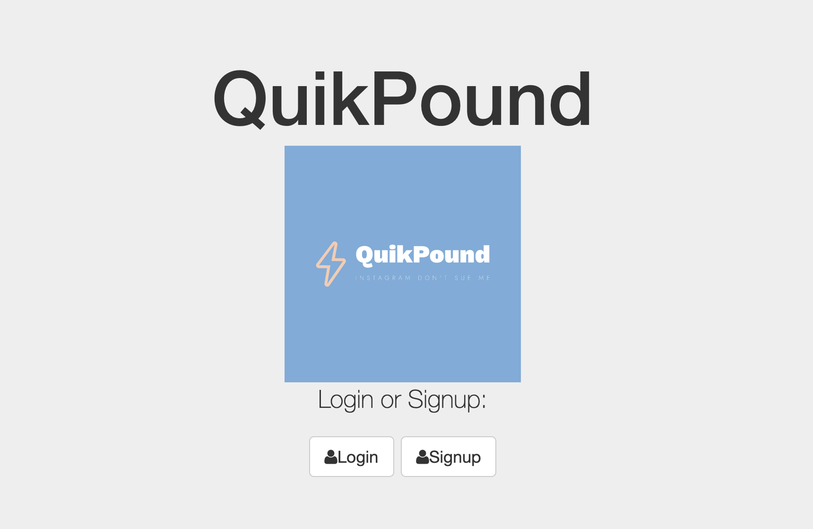

# quikPound# - Instagram Clone Project
# Phase 1: Login, Create User-specific Posts, Unique Post Pages

## Description

- CRUD web app that allows users to create an account, login, create posts, and navigate to post pages.
- The profile page shows all the links to the user's posts

## Key Takeaways

- To allow the unique MongoDB ID's to be targeted, use ```var ObjectId = require('mongodb').ObjectID```
- Alternate **Parameters**/**Queries** Syntax for GET (READ):

    1)
    PARAMETER (token is what follows ":")

      ```
      app.get('/posts/:post_id', function...
      var uId = ObjectId(req.params.post_id)
      // uId = 5819d9asd83818
      )
      ```
      URL: http://localhost:8080/posts/5819d9asd83818

    2)
    QUERY (has query strings; more than one is ok using "&")

      ```
      app.get('/posts', function...
      var uId = ObjectId(req.query.post_id)
      // uId = 5819d9asd83818
      )
      ```
      URL: http://localhost:8080/posts?id=5819d9asd83818

## Technologies Used:

- Javascript, HTML5, CSS3, Node.js, Express.js, Passport.js, MongoDB, Git

## Installation

1. Clone repo
2. run `npm install`

## Usage

1. Open terminal
2. Change directory to quikPond folder
2. Run `node server.js`
3. In Browser, navigate to `localhost:8080`
# quikPound-phase2
